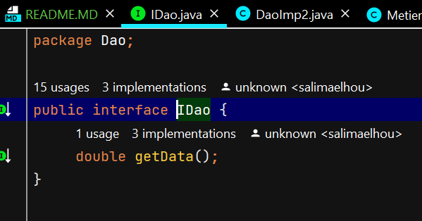

<h2>Injection des dépendances</h2>
<h4>1- Creation d'Interface IDao :</h4>

<h4>2- Implimentation de cette Interface :</h4>
<h4>3- Creation d'Interface IMetier :</h4>
<h4>4- Implimentation de cette Interface :</h4>
<h4>5- Injection des dépendaces :</h4>
<h6>a. Par instanciation statique :</h6>
<h6>b. Par instanciation dynamique :</h6>

avec le fichier config.txt est :

<h6>En utilisant le Framework Spring :</h6>

Version XML :

avec le fichier config.xml est :

Version annotations :

en ajoutent bien sure l'annotation @Repository("dao") sur la class DaoImpl , mème l'annotation @Service("metier") sur la class MetierImpl
